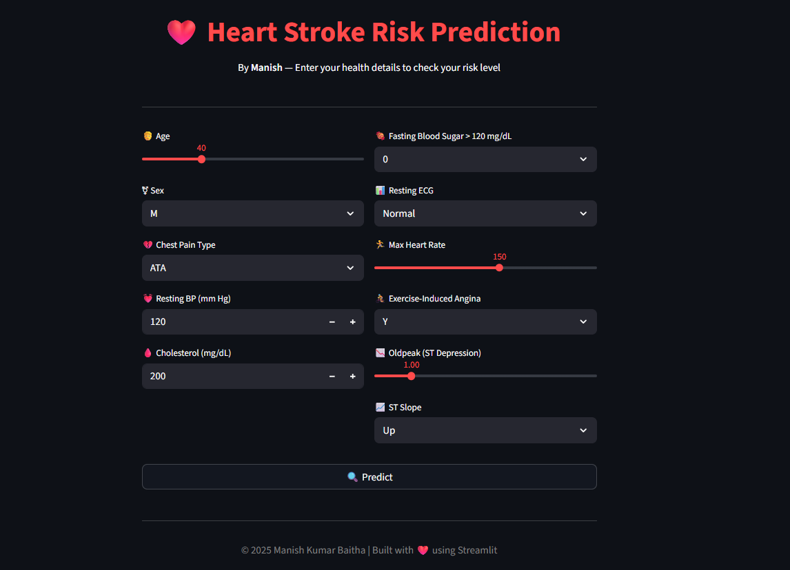

# ❤️ Heart Stroke Risk Prediction

A **Streamlit** web application that predicts the risk of a heart stroke based on user health details.  
The prediction is powered by a **Logistic Regression Machine Learning Model** trained on real medical data.

---

## 📌 Overview

This app allows users to input their health parameters such as age, blood pressure, cholesterol levels, and more.  
The model then analyzes the inputs and predicts whether the user is at **high risk** or **low risk** for a heart stroke.

---

## 📸 Screenshot



---

## 🗂 Project Structure


---

## 📊 Dataset

- **File**: `heart.csv`  
- **Source**: UCI Heart Disease Dataset / Kaggle  
- **Description**: Contains patient health records with various medical attributes.  
- **Target Variable**: Heart disease presence (1) or absence (0)  

**Columns include:**
- Age
- Sex
- Chest Pain Type
- Resting BP (mm Hg)
- Cholesterol (mg/dL)
- Fasting Blood Sugar
- Resting ECG
- Max Heart Rate
- Exercise-Induced Angina
- Oldpeak (ST Depression)
- ST Slope

---

## 🛠 Tech Stack

- **Frontend/UI**: [Streamlit](https://streamlit.io/)
- **Backend/ML**: Scikit-learn, Pandas, Joblib
- **Programming Language**: Python
- **Data Visualization**: Matplotlib, Seaborn (in training notebook)

---

## ⚙️ Installation & Setup

### 1️⃣ Clone the repository
```bash
git clone https://github.com/manishkr6/heart-health-predictor.git
cd heart-health-predictor
pip install -r requirements.txt
streamlit run app.py
